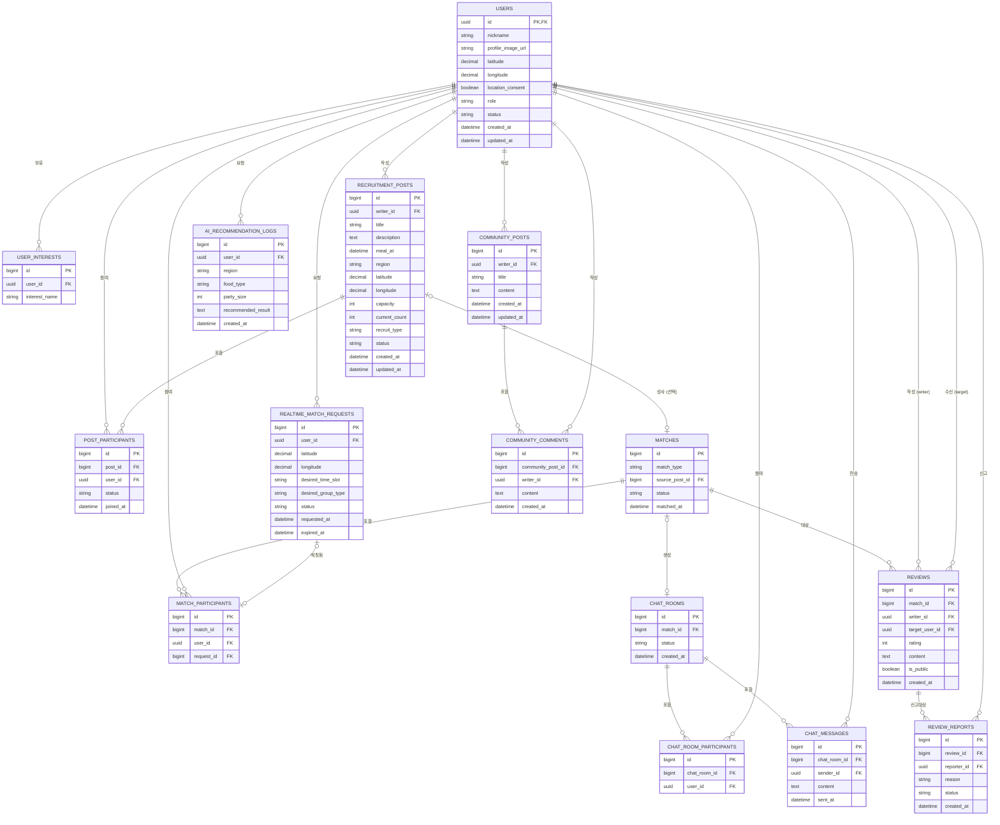

<aside>
💡
요구사항 정의서(FR-01~FR-09)와 기술 스택(PostgreSQL+PostGIS, Redis)을 기준으로 작성한 데이터 모델입니다. DB는 PostgreSQL(Supabase) + PostGIS, 임시 상태는 Redis를 사용합니다.

</aside>

# 1. 설계 개요

- 영구 데이터(회원, 게시글, 매칭 이력, 채팅, 후기 등)는 **PostgreSQL**에 저장한다.
- 인증 계정과 자격 증명은 **Supabase Auth의 `auth.users`**가 관리하며, 서비스 프로필인 `public.users.id`는 `auth.users.id`와 동일한 UUID를 사용한다. 비밀번호 해시와 소셜 계정 토큰은 서비스 테이블에 저장하지 않는다.
- 실시간 매칭 대기열처럼 자주 바뀌고 휘발성이 강한 상태(FR-03-05)는 **Redis**(Geo 자료구조 + TTL)에서 관리하고, `realtime_match_requests` 테이블은 매칭 요청의 이력/감사 기록으로만 사용한다. 매칭이 성사되거나 만료되면 Redis 큐에서는 제거되고 결과만 PostgreSQL에 반영된다.
- 위치 기반 검색(FR-04)을 위해 각 테이블에 `latitude`/`longitude` 외에 PostGIS `geography(Point,4326)` 파생 컬럼(`location`)을 두고 **GIST 공간 인덱스**를 건다. 반경 검색은 `ST_DWithin(location, ..., radius)`로 처리한다.
- 상태값(모집중/마감/완료 등)은 초기에는 `varchar` + CHECK 제약으로 두고, 값이 안정화되면 Postgres `ENUM` 타입 전환을 권장한다.

---

# 1. 개념적 설계 (Conceptual Design)

이 단계에서는 속성이나 타입을 제외하고, "어떤 개체들이 있고 서로 어떻게 연결되는지"만 파악한다. 기획·디자인 담당자와 이 단계에서 먼저 구조를 맞추는 것을 권장한다.

## 1.1 핵심 개체(Entity) 목록

| 개체명 | 영문 테이블명 | 설명 |
| --- | --- | --- |
| 회원 | `users` | 서비스를 이용하는 사용자 |
| 관심사 | `user_interests` | 회원이 등록한 관심사 태그 |
| 모집 게시글 | `recruitment_posts` | 함께 식사할 사람을 모집하는 게시글 |
| 게시글 참여 | `post_participants` | 회원이 모집 게시글에 참여한 기록 |
| 실시간 매칭 요청 | `realtime_match_requests` | 회원이 실시간 매칭을 요청한 기록 |
| 매칭 | `matches` | 실제로 성사된 식사 매칭 1건 |
| 매칭 참여자 | `match_participants` | 한 매칭에 참여한 회원들 |
| 채팅방 | `chat_rooms` | 매칭 성사 후 생성되는 대화 공간 |
| 채팅방 참여자 | `chat_room_participants` | 채팅방에 입장한 회원들 |
| 채팅 메시지 | `chat_messages` | 채팅방 내에서 오간 메시지 |
| 커뮤니티 게시글 | `community_posts` | 자유 주제의 게시판 글 |
| 댓글 | `community_comments` | 커뮤니티 게시글에 달린 댓글 |
| 후기 | `reviews` | 매칭 상대에 대한 방명록식 평가 |
| 후기 신고 | `review_reports` | 부적절한 후기에 대한 신고 |
| AI 추천 로그 | `ai_recommendation_logs` | AI 식당 추천 요청/응답 기록 |

## 1.3 관계 요약

| 관계 | 설명 |
| --- | --- |
| 회원 1 : N 모집게시글 | 한 회원이 여러 모집 게시글 작성 |
| 모집게시글 N : M 회원 (게시글참여) | 게시글에 여러 회원이 참여 |
| 회원 1 : N 실시간매칭요청 | 실시간 매칭 요청 이력 |
| 매칭 N : M 회원 (매칭참여자) | 성사된 매칭에 참여한 회원들 |
| 매칭 1 : 1 채팅방 | 매칭 성사 시 채팅방 자동 생성 (FR-05-01) |
| 채팅방 1 : N 채팅메시지 | 채팅방 내 메시지 |
| 매칭 1 : N 후기 | 매칭 참여자 간 후기 (FR-07-01, 실참여자만 작성 가능) |
| 후기 1 : N 후기신고 | 후기 신고 (FR-07-04) |

# 2. ERD



---

# 3. 논리적 설계 (Logical Design)

DBMS에 종속되지 않는 범용 타입(INTEGER, VARCHAR, TEXT, DECIMAL, BOOLEAN, DATETIME)과 키·제약조건을 정의한다. 이 단계에서는 아직 PostgreSQL이나 PostGIS 같은 특정 제품의 기능(공간 인덱스, 파생 컬럼 등)은 등장하지 않는다.

## 3.1 정규화 설계 노트

- **1NF (원자값)**: 회원의 관심사를 `users` 테이블에 콤마로 구분된 문자열로 저장하지 않고, `user_interests`라는 별도 테이블로 분리해 회원 1명이 관심사를 여러 개 가질 수 있도록 했다. 다중값 속성을 별도 테이블로 분리하는 전형적인 1NF 적용 사례다.
- **2NF/3NF (N:M 관계 해소)**: "회원이 게시글에 참여한다"는 N:M 관계를 `post_participants` 중간 테이블로 풀었다. 마찬가지로 "회원이 매칭에 참여한다"는 `match_participants`로, "회원이 채팅방에 있다"는 `chat_room_participants`로 해소했다. 이런 관계 테이블이 없다면 한 당사자가 여러 게시글/매칭에 참여할 때 컬럼을 반복해야 하는 이상이 생긴다.
- 대부분의 테이블이 단일 키 기준 이미 3NF를 만족하며, 별도의 부분·이행 함수 종속이 남아있지 않다.

## 3.2 논리 스키마 (엔티티별 속성)

### `users` — FR-01

| 속성 | 논리 타입    | 키/제약 | 설명 |
| --- |----------| --- | --- |
| `id` | UUID | PK, FK → auth.users.id | Supabase Auth 사용자와 동일한 회원 식별자 |
| `nickname` | VARCHAR(50) | NOT NULL | FR-01-05 |
| `profile_image_url` | VARCHAR(500) | NULL 허용 | FR-01-05 |
| `latitude` / `longitude` | DECIMAL(9,6) | NULL 허용 | 최근 위치 (FR-04-01) |
| `location_consent` | BOOLEAN  | NOT NULL | 위치 수집 동의 여부 (FR-04-06) |
| `role` | VARCHAR(20) | NOT NULL | MEMBER / ADMIN (FR-01-07) |
| `status` | VARCHAR(20) | NOT NULL | ACTIVE / WITHDRAWN |
| `created_at` / `updated_at` | DATETIME | NOT NULL |  |

### `user_interests` — FR-01-05

| 속성 | 논리 타입 | 키/제약 | 설명 |
| --- | --- | --- | --- |
| `id` | INTEGER | PK |  |
| `user_id` | UUID | FK → users.id |  |
| `interest_name` | VARCHAR(50) | NOT NULL | 예: "등산", "보드게임" |

### `recruitment_posts` — FR-02

| 속성 | 논리 타입 | 키/제약 | 설명 |
| --- | --- | --- | --- |
| `id` | INTEGER | PK |  |
| `writer_id` | UUID | FK → users.id |  |
| `title` | VARCHAR(100) | NOT NULL | FR-02-02 |
| `description` | TEXT | NULL 허용 | FR-02-02 |
| `meal_at` | DATETIME | NOT NULL | 식사 날짜/시간 (FR-02-03) |
| `region` | VARCHAR(100) | NULL 허용 | 지역명 텍스트 (FR-02-04) |
| `latitude` / `longitude` | DECIMAL(9,6) | NULL 허용 | 식당·지역 좌표 (FR-04-02) |
| `capacity` | INTEGER | NOT NULL | 모집 인원 (FR-02-05) |
| `current_count` | INTEGER | NOT NULL | 현재 참여 인원 |
| `recruit_type` | VARCHAR(20) | NOT NULL | SMALL / LARGE (FR-02-06) |
| `status` | VARCHAR(20) | NOT NULL | OPEN / CLOSED / DONE (FR-02-07) |
| `created_at` / `updated_at` | DATETIME | NOT NULL |  |

### `post_participants`

| 속성 | 논리 타입 | 키/제약 | 설명 |
| --- | --- | --- | --- |
| `id` | INTEGER | PK |  |
| `post_id` | INTEGER | FK → recruitment_posts.id |  |
| `user_id` | UUID | FK → users.id |  |
| `status` | VARCHAR(20) | NOT NULL | JOINED / CANCELLED |
| `joined_at` | DATETIME | NOT NULL |  |

<aside>
📌

`(post_id, user_id)` 조합은 논리적으로 유일해야 한다 (중복 참여 방지).

</aside>

### `realtime_match_requests` — FR-03

| 속성 | 논리 타입 | 키/제약 | 설명 |
| --- | --- | --- | --- |
| `id` | INTEGER | PK |  |
| `user_id` | UUID | FK → users.id |  |
| `latitude` / `longitude` | DECIMAL(9,6) | NOT NULL | 요청 시점 위치 (FR-03-02) |
| `desired_time_slot` | VARCHAR(50) | NOT NULL | 희망 식사 시간대 (FR-03-03) |
| `desired_group_type` | VARCHAR(20) | NOT NULL | 희망 인원/유형 (FR-03-04) |
| `status` | VARCHAR(20) | NOT NULL | WAITING / MATCHED / CANCELLED / EXPIRED |
| `requested_at` | DATETIME | NOT NULL |  |
| `expired_at` | DATETIME | NULL 허용 | 자동 만료 시각 (FR-03-09) |

### `matches`

| 속성 | 논리 타입 | 키/제약 | 설명 |
| --- | --- | --- | --- |
| `id` | INTEGER | PK |  |
| `match_type` | VARCHAR(20) | NOT NULL | REALTIME / POST_BASED |
| `source_post_id` | INTEGER | FK → recruitment_posts.id, NULL 허용 | 게시글 기반 매칭일 때만 값 존재 |
| `status` | VARCHAR(20) | NOT NULL | MATCHED / COMPLETED / CANCELLED |
| `matched_at` | DATETIME | NOT NULL |  |

### `match_participants`

| 속성 | 논리 타입 | 키/제약 | 설명 |
| --- | --- | --- | --- |
| `id` | INTEGER | PK |  |
| `match_id` | INTEGER | FK → matches.id |  |
| `user_id` | UUID | FK → users.id |  |
| `request_id` | INTEGER | FK → realtime_match_requests.id, NULL 허용 | 실시간 매칭으로 성사된 경우 연결 |

### `chat_rooms` — FR-05

| 속성 | 논리 타입 | 키/제약 | 설명 |
| --- | --- | --- | --- |
| `id` | INTEGER | PK |  |
| `match_id` | INTEGER | FK → matches.id, UNIQUE | 매칭 1건당 채팅방 1개 (FR-05-01) |
| `status` | VARCHAR(20) | NOT NULL | ACTIVE / CLOSED (FR-05-06) |
| `created_at` | DATETIME | NOT NULL |  |

### `chat_room_participants`

| 속성 | 논리 타입 | 키/제약 | 설명 |
| --- | --- | --- | --- |
| `id` | INTEGER | PK |  |
| `chat_room_id` | INTEGER | FK → chat_rooms.id |  |
| `user_id` | UUID | FK → users.id | 허가되지 않은 사용자 접근 차단 (FR-05-05)의 기준 데이터 |

### `chat_messages`

| 속성 | 논리 타입 | 키/제약 | 설명 |
| --- | --- | --- | --- |
| `id` | INTEGER | PK |  |
| `chat_room_id` | INTEGER | FK → chat_rooms.id |  |
| `sender_id` | UUID | FK → users.id |  |
| `content` | TEXT | NOT NULL |  |
| `sent_at` | DATETIME | NOT NULL | 페이지네이션 (FR-05-04) 시 커서로 사용 |

### `community_posts` — FR-06

| 속성 | 논리 타입 | 키/제약 | 설명 |
| --- | --- | --- | --- |
| `id` | INTEGER | PK |  |
| `writer_id` | UUID | FK → users.id |  |
| `title` | VARCHAR(100) | NOT NULL |  |
| `content` | TEXT | NOT NULL |  |
| `created_at` / `updated_at` | DATETIME | NOT NULL |  |

### `community_comments` — FR-06-05

| 속성 | 논리 타입 | 키/제약 | 설명 |
| --- | --- | --- | --- |
| `id` | INTEGER | PK |  |
| `community_post_id` | INTEGER | FK → community_posts.id |  |
| `writer_id` | UUID | FK → users.id |  |
| `content` | TEXT | NOT NULL |  |
| `created_at` | DATETIME | NOT NULL |  |

### `reviews` — FR-07

| 속성 | 논리 타입 | 키/제약 | 설명 |
| --- | --- | --- | --- |
| `id` | INTEGER | PK |  |
| `match_id` | INTEGER | FK → matches.id | 실제 매칭 참여 검증 기준 (FR-07-01) |
| `writer_id` | UUID | FK → users.id |  |
| `target_user_id` | UUID | FK → users.id | 후기 대상자 |
| `rating` | INTEGER | NULL 허용, 1~5 | 간단 평가 (FR-07-03) |
| `content` | TEXT | NULL 허용 |  |
| `is_public` | BOOLEAN | NOT NULL | 비공개 처리 옵션 (FR-07-05) |
| `created_at` | DATETIME | NOT NULL |  |

### `review_reports` — FR-07-04

| 속성 | 논리 타입 | 키/제약 | 설명 |
| --- | --- | --- | --- |
| `id` | INTEGER | PK |  |
| `review_id` | INTEGER | FK → reviews.id |  |
| `reporter_id` | UUID | FK → users.id |  |
| `reason` | VARCHAR(200) | NOT NULL |  |
| `status` | VARCHAR(20) | NOT NULL | PENDING / RESOLVED |
| `created_at` | DATETIME | NOT NULL |  |

### `ai_recommendation_logs` — FR-08

| 속성 | 논리 타입 | 키/제약 | 설명 |
| --- | --- | --- | --- |
| `id` | INTEGER | PK |  |
| `user_id` | UUID | FK → users.id |  |
| `region` | VARCHAR(100) | NULL 허용 | 요청 조건 (FR-08-02) |
| `food_type` | VARCHAR(50) | NULL 허용 |  |
| `party_size` | INTEGER | NULL 허용 |  |
| `recommended_result` | TEXT | NULL 허용 | AI 응답 (추천 식당 목록) |
| `created_at` | DATETIME | NOT NULL |  |

---

# 4. 물리적 설계 (Physical Design)

## 4.1 DBMS 선정 및 설계 방향

- 영구 데이터(회원, 게시글, 매칭 이력, 채팅, 후기 등)는 **PostgreSQL(Supabase)**에 저장한다.
- 인증 데이터는 `auth.users`가 관리하고 서비스 프로필은 `public.users`에 분리한다. 두 테이블은 같은 UUID를 사용하며 신규 가입 시 트리거로 프로필을 생성한다.
- 실시간 매칭 대기열처럼 자주 바뀌고 휘발성이 강한 상태(FR-03-05)는 **Redis**(Geo 자료구조 + TTL)에서 관리하고, `realtime_match_requests` 테이블은 매칭 요청의 이력/감사 기록으로만 사용한다.
- 위치 기반 검색(FR-04)을 위해 논리 설계에는 없던 `location` (PostGIS `geography(Point,4326)`) 파생 컬럼을 물리 설계에서 추가하고 GIST 공간 인덱스를 건다.
- 상태값은 초기에는 `varchar` + CHECK 제약으로 두고, 값이 안정화되면 Postgres `ENUM` 타입 전환을 권장한다.

## 4.2 논리 → 물리 타입 매핑

| 논리 타입 | PostgreSQL 물리 타입 | 비고 |
| --- | --- | --- |
| INTEGER (PK) | `bigint generated always as identity` | 대규모 증가 대비 bigint 선택 |
| UUID | `uuid` | Supabase `auth.users.id` 및 모든 사용자 참조 키 |
| VARCHAR(n) | `varchar(n)` | 동일 |
| TEXT | `text` | 동일 |
| DATETIME | `timestamptz` | 타임존 포함 저장 |
| BOOLEAN | `boolean` | 동일 |
| DECIMAL(p,s) | `numeric(p,s)` | 동일 |
| 위치 (latitude+longitude) |   • `geography(Point,4326)` 파생 컬럼 | GIST 인덱스로 반경 검색 가속화 |

## 4.3 엔티티별 물리 설계 추가사항

논리 스키마에 없던, 물리 설계에서만 추가되는 내용만 정리한다. 언급되지 않은 테이블(`user_interests`, `post_participants`, `match_participants`, `chat_rooms`, `chat_room_participants`, `community_posts`, `community_comments`, `review_reports`)은 특별한 물리 이슈 없이 논리 스키마를 그대로 물리 스키마로 사용한다.

| 테이블 | 물리 설계 추가사항 |
| --- | --- |
| `users` | `id uuid`로 `auth.users(id)` 참조; 인증 정보는 저장하지 않고 서비스 프로필·권한·상태만 관리; `location geography(Point,4326)` 및 GIST 인덱스 추가 |
| `recruitment_posts` | `location geography`  • GIST 인덱스; `current_count == capacity` 시 `status`를 CLOSED로 자동 전환하는 트리거/애플리케이션 로직 필요 (FR-02-09) |
| `realtime_match_requests` | 실제 "대기 중" 상태는 Redis Geo 자료구조로 별도 관리; 이 테이블은 WAITING→MATCHED/CANCELLED/EXPIRED 전환 시점에만 기록; 동일 사용자 중복 대기는 Redis 키(`waiting:{user_id}`) 존재 여부로 차단 (FR-03-10) |
| `chat_messages` | `(chat_room_id, sent_at)` 복합 인덱스로 커서 기반 페이지네이션 가속화 (FR-05-04) |
| `reviews` | `rating` 컬럼에 `CHECK (rating BETWEEN 1 AND 5)` 제약 추가 |
| `ai_recommendation_logs` | 나머지 서비스와 완전히 분리된 스키마/API로 구성해 이 기능 장애가 다른 기능에 영향을 주지 않도록 격리 (FR-08-03) |

## 4.4 예시 DDL

```sql
CREATE TABLE users (
    id UUID PRIMARY KEY REFERENCES auth.users(id) ON DELETE RESTRICT,
    nickname VARCHAR(50) NOT NULL,
    profile_image_url VARCHAR(500),
    latitude NUMERIC(9,6),
    longitude NUMERIC(9,6),
    location GEOGRAPHY(Point, 4326),
    location_consent BOOLEAN NOT NULL DEFAULT FALSE,
    role VARCHAR(20) NOT NULL DEFAULT 'MEMBER',
    status VARCHAR(20) NOT NULL DEFAULT 'ACTIVE',
    created_at TIMESTAMPTZ NOT NULL DEFAULT now(),
    updated_at TIMESTAMPTZ NOT NULL DEFAULT now()
);

CREATE INDEX idx_users_location ON users USING GIST (location);

CREATE OR REPLACE FUNCTION public.handle_new_auth_user()
RETURNS trigger
LANGUAGE plpgsql
SECURITY DEFINER SET search_path = ''
AS $$
BEGIN
    INSERT INTO public.users (id, nickname, profile_image_url)
    VALUES (
        NEW.id,
        COALESCE(NEW.raw_user_meta_data ->> 'nickname', NEW.raw_user_meta_data ->> 'name', '사용자'),
        COALESCE(NEW.raw_user_meta_data ->> 'avatar_url', NEW.raw_user_meta_data ->> 'picture')
    );
    RETURN NEW;
END;
$$;

CREATE TRIGGER on_auth_user_created
AFTER INSERT ON auth.users
FOR EACH ROW EXECUTE FUNCTION public.handle_new_auth_user();
```

```sql
CREATE TABLE recruitment_posts (
    id BIGINT GENERATED ALWAYS AS IDENTITY PRIMARY KEY,
    writer_id UUID NOT NULL REFERENCES users(id),
    title VARCHAR(100) NOT NULL,
    description TEXT,
    meal_at TIMESTAMPTZ NOT NULL,
    region VARCHAR(100),
    latitude NUMERIC(9,6),
    longitude NUMERIC(9,6),
    location GEOGRAPHY(Point, 4326),
    capacity INT NOT NULL,
    current_count INT NOT NULL DEFAULT 1,
    recruit_type VARCHAR(20) NOT NULL DEFAULT 'SMALL',
    status VARCHAR(20) NOT NULL DEFAULT 'OPEN' CHECK (status IN ('OPEN','CLOSED','DONE')),
    created_at TIMESTAMPTZ NOT NULL DEFAULT now(),
    updated_at TIMESTAMPTZ NOT NULL DEFAULT now()
);

CREATE INDEX idx_posts_location ON recruitment_posts USING GIST (location);
CREATE INDEX idx_posts_status ON recruitment_posts (status);
```

```sql
CREATE TABLE chat_messages (
    id BIGINT GENERATED ALWAYS AS IDENTITY PRIMARY KEY,
    chat_room_id BIGINT NOT NULL REFERENCES chat_rooms(id),
    sender_id UUID NOT NULL REFERENCES users(id),
    content TEXT NOT NULL,
    sent_at TIMESTAMPTZ NOT NULL DEFAULT now()
);

CREATE INDEX idx_messages_room_time ON chat_messages (chat_room_id, sent_at DESC);
```

---

# 5. 관리자 (4순위, 참고용)

문서의 MVP 우선순위상 관리자 기능은 4순위이므로 상세 설계는 이번 버전에서 확정하지 않는다. 현재는 `users.role = 'ADMIN'`으로만 구분하고, 이후 신고 처리·게시글 관리 이력이 필요해지면 `admin_actions(id, admin_id, target_type, target_id, action, created_at)` 형태의 감사 로그 테이블 추가를 권장한다.

---

# 6. 설계 시 확인이 필요한 지점

- `recruit_type` (소규모/대규모)이 선택 요구사항인데, 인원수 범위 자체(예: 소규모 2~4명, 대규모 5명 이상)를 어디서 정의할지 — 코드/설정값으로 둘지 팀과 정하면 좋겠습니다.
- `reviews.rating`을 숫자 평점으로 둘지, 아니면 방명록처럼 자유 텍스트만 남길지 팀 논의가 필요해 보입니다 (문서상 "간단한 평가 또는 내용"으로만 명시됨).
